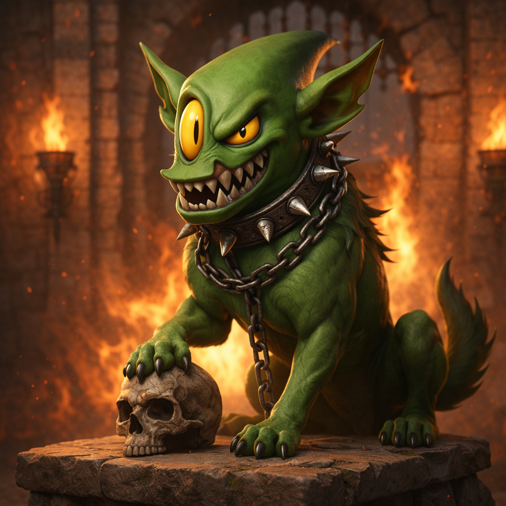

# 🐕 mostro-watchdog

[](https://github.com/MostroP2P/mostro-watchdog/actions/workflows/ci.yml)
[](https://github.com/MostroP2P/mostro-watchdog/actions/workflows/release.yml)
[](https://github.com/MostroP2P/mostro-watchdog/releases/latest)
[](https://opensource.org/licenses/MIT)

<p align="center">
  
</p>

Real-time Telegram notification bot for [Mostro](https://mostro.network) administrators. Monitors Nostr dispute events (kind 38386) and sends instant alerts to a Telegram group or channel.

## Why?

When a user opens a dispute on Mostro, administrators need to respond quickly. Users in disputes are worried — fast response times build trust and improve the experience.

**mostro-watchdog** bridges Nostr and Telegram so admins get notified the instant a dispute is created, without needing to monitor Mostrix or Nostr clients constantly.

## How it works

```text
Mostro daemon → Nostr (kind 38386) → mostro-watchdog → Telegram alert
```

1. Mostro daemon publishes a dispute event (kind 38386) to Nostr relays
2. mostro-watchdog subscribes to these events filtered by your Mostro's pubkey
3. When a new dispute is detected (status: `initiated`), it sends a formatted alert to your Telegram group/channel
4. Admins see the alert and can take the dispute via Mostrix or their preferred admin client

If your node runs [Serbero](https://github.com/MostroP2P/serbero), Mostro's dispute
assistant, the watchdog can also follow it: it shows Serbero's progress on each
dispute's message and pings the group when Serbero hands a dispute off and a human
solver must take it over. See [Serbero Alerts](#serbero-alerts).

Solvers can also link their Mostro solver key to the bot and get a private message
when a party writes to them in a dispute they took, without giving the watchdog any
private key. See [Solver Notifications](#solver-notifications).

## Quick Start

### Prerequisites

- [Rust](https://rustup.rs/) (1.75+)
- A Telegram bot token (from [@BotFather](https://t.me/BotFather))
- Your Mostro daemon's Nostr public key

#### Native Build Dependencies

Some Rust crates require native libraries and build tools. Install them before building:

**Ubuntu / Debian:**

```bash
sudo apt update
sudo apt install -y cmake pkg-config libssl-dev
```

**macOS (Homebrew):**

```bash
brew install cmake openssl pkg-config
export OPENSSL_DIR=$(brew --prefix openssl)
```

> **Tip:** Add the `export OPENSSL_DIR=...` line to your `~/.zshrc` (or `~/.bashrc`) so you don't have to set it every time.

### Install

#### Option 1: Automatic Installation Script (Recommended)

The easiest way to install mostro-watchdog is using our installation script:

```bash
# Download and run the installation script
curl -fsSL https://raw.githubusercontent.com/MostroP2P/mostro-watchdog/main/install.sh | bash

# Or for custom installation directory:
curl -fsSL https://raw.githubusercontent.com/MostroP2P/mostro-watchdog/main/install.sh | bash -s -- --install-dir ~/.local/bin
```

> **Prefer to inspect before running?**
>
> ```bash
> curl -fsSL -o install.sh https://raw.githubusercontent.com/MostroP2P/mostro-watchdog/main/install.sh
> less install.sh        # review the script
> bash install.sh        # run after inspection
> ```

The script will:
- ✅ Auto-detect your platform (Linux x64/ARM64, macOS Intel/Apple Silicon, Windows via WSL/Git Bash/MSYS2)
- ✅ Download the latest pre-built binary
- ✅ Verify checksums for security
- ✅ Install to `/usr/local/bin` (or custom directory)
- ✅ Set executable permissions
- ✅ Provide next steps guidance

#### Option 2: Manual Binary Download

Download the latest binary for your platform from the [releases page](https://github.com/MostroP2P/mostro-watchdog/releases/latest):

**Linux:**
```bash
# x86_64 (Intel/AMD)
curl -LO https://github.com/MostroP2P/mostro-watchdog/releases/latest/download/mostro-watchdog-linux-x86_64
chmod +x mostro-watchdog-linux-x86_64
sudo mv mostro-watchdog-linux-x86_64 /usr/local/bin/mostro-watchdog

# ARM64 (Raspberry Pi, ARM servers)
curl -LO https://github.com/MostroP2P/mostro-watchdog/releases/latest/download/mostro-watchdog-linux-aarch64
chmod +x mostro-watchdog-linux-aarch64
sudo mv mostro-watchdog-linux-aarch64 /usr/local/bin/mostro-watchdog
```

**macOS:**
```bash
# Intel Macs
curl -LO https://github.com/MostroP2P/mostro-watchdog/releases/latest/download/mostro-watchdog-macos-x86_64
chmod +x mostro-watchdog-macos-x86_64
sudo mv mostro-watchdog-macos-x86_64 /usr/local/bin/mostro-watchdog

# Apple Silicon (M1/M2/M3)
curl -LO https://github.com/MostroP2P/mostro-watchdog/releases/latest/download/mostro-watchdog-macos-aarch64
chmod +x mostro-watchdog-macos-aarch64
sudo mv mostro-watchdog-macos-aarch64 /usr/local/bin/mostro-watchdog
```

**Windows:**
```powershell
# Download and install to user directory
$UserBin = "$env:USERPROFILE\bin"
New-Item -ItemType Directory -Force -Path $UserBin
Invoke-WebRequest -Uri "https://github.com/MostroP2P/mostro-watchdog/releases/latest/download/mostro-watchdog-windows-x86_64.exe" -OutFile "$UserBin\mostro-watchdog.exe"
# Add $UserBin to your PATH environment variable if not already present
```

**Verify the download** (recommended):
```bash
# Download checksums
curl -LO https://github.com/MostroP2P/mostro-watchdog/releases/latest/download/manifest.txt

# Verify your binary
# Linux/WSL
sha256sum -c manifest.txt --ignore-missing

# macOS
shasum -a 256 -c manifest.txt

# Windows (PowerShell)
# Manual verification - compare hash from manifest.txt with:
# Get-FileHash .\mostro-watchdog-windows-x86_64.exe -Algorithm SHA256
```

#### Option 3: Docker

```bash
git clone https://github.com/MostroP2P/mostro-watchdog.git
cd mostro-watchdog
cp config.example.toml config.toml
# Edit config.toml with your settings
docker compose up -d
```

Pre-built images are available from GitHub Container Registry:

```bash
docker pull ghcr.io/mostrop2p/mostro-watchdog:latest
docker run -d --name mostro-watchdog --restart unless-stopped \
  -v $(pwd)/config.toml:/config/config.toml:ro \
  ghcr.io/mostrop2p/mostro-watchdog:latest
```

See [DOCKER.md](DOCKER.md) for full documentation.

#### Option 4: Build from Source

```bash
git clone https://github.com/MostroP2P/mostro-watchdog.git
cd mostro-watchdog
cargo build --release

# Binary will be at ./target/release/mostro-watchdog
```

### Configure

```bash
# Copy the example config
cp config.example.toml config.toml

# Edit with your values
nano config.toml
```

You'll need to set:
- `mostro.pubkey` — Your Mostro daemon's Nostr public key
- `nostr.relays` — The relays your Mostro daemon uses
- `telegram.bot_token` — Token from @BotFather
- `telegram.chat_id` — The Telegram group/channel ID for alerts

### Run

```bash
# Default (looks for ./config.toml, then ~/.config/mostro-watchdog/config.toml)
./target/release/mostro-watchdog

# Custom config path
./target/release/mostro-watchdog --config /path/to/config.toml

# Positional argument also works
./target/release/mostro-watchdog /path/to/config.toml

# With debug logging
RUST_LOG=mostro_watchdog=debug ./target/release/mostro-watchdog

# Help & version
./target/release/mostro-watchdog --help
./target/release/mostro-watchdog --version
```

The config file is searched in this order:
1. `./config.toml` (current directory)
2. `~/.config/mostro-watchdog/config.toml`

Or specify it explicitly with `--config` / `-c`.

### Setting up the Telegram bot

1. Open Telegram and message [@BotFather](https://t.me/BotFather)
2. Send `/newbot` and follow the instructions to create a new bot
3. Copy the bot token to your `config.toml`
4. Create a private group/channel for your admin team
5. Add the bot to the group/channel
6. Get the chat ID (see config.example.toml for instructions)

## Bot Commands

The bot answers commands **in private chats only**. Commands sent in a group or
channel are ignored, so the dispute channel keeps carrying dispute alerts and
nothing else — message the bot directly instead.

| Command | Description |
|---------|-------------|
| `/version` | Show the running version and the git commit it was built from |
| `/link` | Link your Mostro solver key to get dispute chat notifications ([details](#solver-notifications)) |
| `/unlink` | Unlink your solver keys from this chat |
| `/status` | Show the solver keys linked to this chat |

`/version` replies with something like:

```text
🐕 mostro-watchdog

📦 Version: 0.3.0
🔖 Commit: a1b2c3d
```

The commit hash is embedded at build time. Builds made outside a git checkout
report `unknown`; for Docker, pass it explicitly:

```bash
docker build --build-arg GIT_COMMIT=$(git rev-parse --short HEAD) -t mostro-watchdog .
```

## Alert Format

Each dispute gets **one** message in the chat, sent when the dispute opens and
edited in place as it goes on. Its header says where the dispute stands and the
timeline below it says how it got there, in the order things happened:

```text
⚖️ DISPUTE 96629381-bcb8-4d4f-8c66-e8f86f3e86ea
Status: ✅ RESOLVED · released by seller

🚨 09:41:02 Opened by buyer
🤖 09:41:03 Taken by Serbero
🤖 09:41:05 Serbero mediating
🙋 09:48:53 Serbero handed off · facts gathered
🔓 10:07:21 Released by seller · resolved by the parties

All times UTC · 2026-10-10
```

The dispute's message is the whole story, and the only lasting new message is
the one sent when a live dispute status arrives. Telegram does not notify of
an edit, so each live edit is followed by a short reply naming the step,
deleted a minute later: the phones ring and the channel stays clean
(`edit_notifications`, see
[DISPUTE_STATUS_ALERTS.md](DISPUTE_STATUS_ALERTS.md#edit-notifications)).
Solvers show by the name given in `[alerts.solver_names]`, or by a shortened
pubkey.

## Serbero Alerts

[Serbero](https://github.com/MostroP2P/serbero) mediates disputes as a read-only
solver and hands them to human solvers when needed. While it mediates, Mostro shows
the dispute as `in-progress`, so the group would never learn that a handoff happened.
With Serbero alerts on, the watchdog adds each of Serbero's steps to the dispute's
timeline, e.g. `🤖 Serbero mediating` or `🙋 Serbero handed off · conflicting claims`,
and the header says where the dispute stands (`🙋 NEEDS A SOLVER · handed off ·
conflicting claims`). When a solver takes the dispute over from Serbero, the
timeline shows `👨‍⚖️ Taken over by ‹name›`. No separate message is sent for any of
it: the channel only ever holds one message per dispute.

Setup:

1. Generate a Nostr key for the watchdog (e.g. `openssl rand -hex 32`) and export it:
   `export WATCHDOG_NOSTR_PRIVATE_KEY=...` (nsec or hex; never put it in `config.toml`).
2. Add a `[serbero]` section to `config.toml` (an empty one is enough; see
   `config.example.toml`).
3. Start the watchdog and copy the hex public key it logs.
4. Add that key to Serbero's config as an observer, then restart Serbero:

   ```toml
   [[observers]]
   pubkey = "<watchdog hex pubkey>"
   ```

The watchdog hears Serbero only on its own relays (the bootstrap `nostr.relays`, then
the Mostro node's NIP-65 relays), so Serbero must publish to at least one of them.

Observers receive only the first line of each update, never what the parties wrote.
Even if the watchdog is registered as a solver by mistake, it reads only that first
line and drops the rest. See [DISPUTE_STATUS_ALERTS.md](DISPUTE_STATUS_ALERTS.md#serbero-alerts)
for details.

## Solver Notifications

A solver who takes a dispute in Mostrix can get a private Telegram message when a
party writes to them in that dispute's chat:

```text
📩 New message from the buyer

📋 Dispute ID: abc123def456

Open Mostrix to read and answer.
```

The watchdog stays a notification bot. It never holds the solver's or a party's
private key, never reads a chat message and never sends one. Mostrix tells it which
conversations to watch, using their public keys only, and announces the solver's
own messages so they are not notified.

Setup:

1. Export a Nostr key for the watchdog (`export WATCHDOG_NOSTR_PRIVATE_KEY=...`, the
   same one Serbero alerts use) and add a `[solver_notifications]` section to
   `config.toml` (an empty one is enough; see `config.example.toml`).
2. Each solver sends `/link` to the bot in a private chat and enters the code and the
   watchdog key it replies with in Mostrix.

See [SOLVER_NOTIFICATIONS.md](SOLVER_NOTIFICATIONS.md) for how it works, the protocol
Mostrix speaks, and its limits.

## Configuration Reference

| Field | Description |
|-------|-------------|
| `mostro.pubkey` | Mostro daemon's Nostr public key (hex or npub) |
| `nostr.relays` | Array of Nostr relay WebSocket URLs |
| `telegram.bot_token` | Telegram bot API token |
| `telegram.chat_id` | Telegram chat/group/channel ID for alerts |
| `alerts.serbero_progress` | Serbero's steps on the dispute's timeline (default: `true`) |
| `alerts.edit_notifications` | Notify of each live edit of a dispute's message with a reply deleted moments later (default: `true`) |
| `alerts.edit_notification_lifetime` | Seconds that reply stays before it is deleted, at most `300` (default: `60`) |
| `alerts.solver_names` | Table of solver pubkeys (hex) to the name shown on the timeline (default: none) |
| `serbero.private_key_env` | Environment variable with the watchdog's Nostr secret key (default: `WATCHDOG_NOSTR_PRIVATE_KEY`) |
| `serbero.pubkey` | Serbero's public key (hex or npub); read from the Mostro node's info event when omitted |
| `solver_notifications.private_key_env` | Environment variable with the watchdog's Nostr secret key (default: `WATCHDOG_NOSTR_PRIVATE_KEY`) |
| `solver_notifications.grace_period` | Seconds to wait for the solver's `sent` receipt before notifying (default: `20`, at most `600`) |

## Roadmap

- [x] **Pre-built binaries for Linux, macOS, Windows** ✅ *Available now with automatic installation script*
- [x] **Health check / heartbeat notifications** ✅ *Configurable monitoring and alerting*
- [x] **Alert on dispute status changes** ✅ *Monitor all dispute lifecycle events*
- [ ] Multiple Telegram channels for different event types
- [ ] Docker image

## Contributing

Contributions are welcome! Please open an issue first to discuss what you'd like to change.

## License

[MIT](LICENSE)
